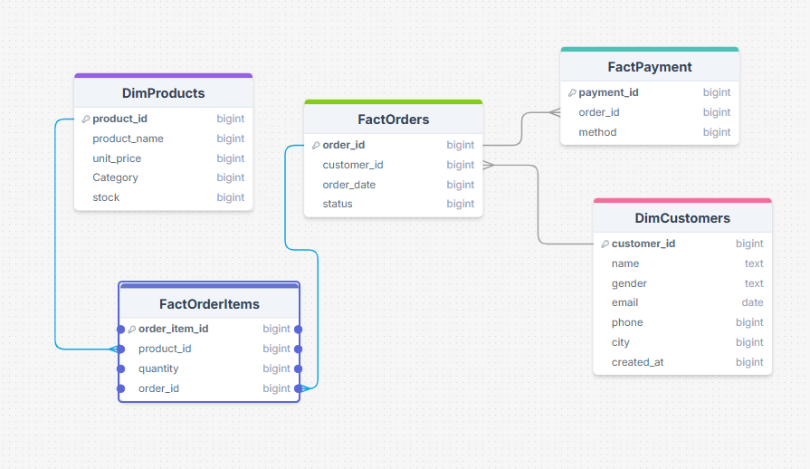
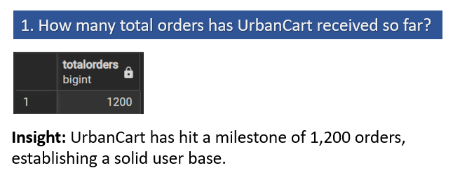
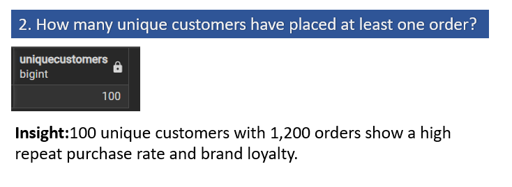
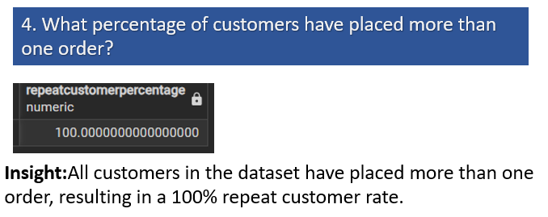
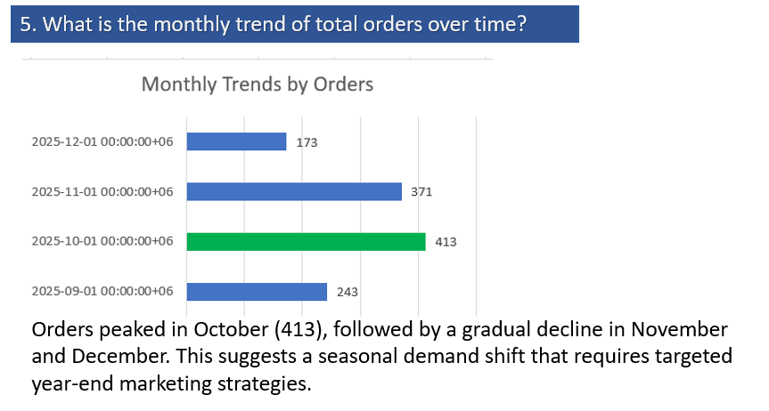
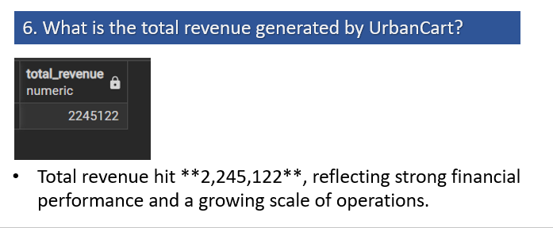

# 🛒 UrbanCart E-commerce Data Analytics Project

## 📖 Introduction
UrbanCart is a growing online retail shop operating across multiple cities. This project focuses on transforming raw transactional data into actionable insights to drive business strategy, marketing decisions, and inventory optimization.

## 👤 My Role
As a **Data Analyst**, my responsibility is to:
- Increase revenue through data-driven decisions.
- Improve product bundling and recommendations.
- Understand customer purchasing behavior.
- Optimize inventory and payment methods.
## 🏗️ Database Architecture (ER Diagram)
Below is the logical structure of the UrbanCart database. It includes dimension tables (Customers, Products) and fact tables (Orders, OrderItems, Payments).

## 🗂️ Data Dictionary
- **DimCustomers:** Customer demographics (customer_id, name, gender, City, email,created_at).
- **DimProducts:** Product catalog (product_id, product_name, category, unit_price, stock).
- **FactOrders:** Transaction headers (order_id, customer_id, order_date, status).
- **FactOrderItems:** Detailed order lines (order_item_iD, product_iD, Quantity,order_id).
- **FactPayment:** Payment transactions (payment_id, order_iD, method).

  ## 🛠️ Analysis Framework & Business Questions

The analysis is structured into five key pillars to provide actionable insights for UrbanCart's strategic growth:

### 1️⃣ Sales & Order Fundamentals
*Focuses on order trends, customer reach, and growth patterns.*
1. **Total Order Volume:** How many total orders has UrbanCart received so far?
2. **Customer Reach:** How many unique customers have placed at least one order?
3. **Geographic Distribution:** Which cities generate the highest number of orders?
4. **Customer Retention:** What percentage of customers have placed more than one order?
5. **Time-Series Analysis:** What is the monthly trend of total orders over time?

### 2️⃣ Revenue & Product Performance
*Focuses on financial health and product-level success.*
6. **Gross Revenue:** What is the total revenue generated by UrbanCart?
7. **Category Contribution:** Which product categories contribute the most to total revenue?
8. **Top Revenue Generators:** Which individual products generate the highest revenue?
9. **Transaction Metrics:** What is the Average Order Value (AOV) and Average Basket Size?

### 3️⃣ Inventory Management & Risk
*Focuses on stock optimization and sales-to-stock ratios.*
10. **Stock-Out Analysis:** Which products are at risk of stock-out due to high sales volume and low inventory?

### 4️⃣ Customer Behavior & Segmentation
*Focuses on who the customers are and how they buy.*
11. **High-Value Customers:** Which customers contribute the highest total revenue?
12. **Purchase Volume:** What is the average number of products purchased per order?
13. **Gender-Based Patterns:** Do male and female customers show different purchasing patterns by category?
14. **City-Wise AOV:** Which cities have the highest average order value?
15. **Customer Lifecycle:** How does customer purchasing behavior change over time since account creation?

### 5️⃣ Payment & Order Flow Insights
*Focuses on transaction efficiency and payment preferences.*
16. **Payment Popularity:** Which payment methods are used most frequently?
17. **Status Analysis:** Is there any relationship between payment method and order status?
18. **Regional Preferences:** Do certain cities prefer specific payment methods?
19. **Payment vs. Value:** Are higher-value orders associated with specific payment methods?

---

## 🚀 Key Insights & Results

